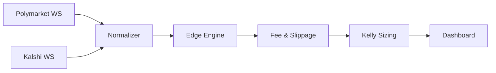

# Prediction Market Arbitrage

A complete spec for building a Polymarket + Kalshi arbitrage engine.

## Goal
Detect same-venue and cross-venue mispricing using live order books, subtract fees/slippage, size positions with Kelly.

## Stack
Next.js frontend, FastAPI backend, PostgreSQL, Redis, CCXT/WebSockets.

## Workflow


## Modules
- Order book parser
- Arbitrage detector
- Fee model
- Slippage simulator
- Kelly optimizer
- Execution simulator

## UI
- Live spread table
- Edge gauge
- Divergence chart
- Order book depth
- PnL simulator

## Math
Edge = 1-(YesAsk+NoAsk); Kelly uses net edge after costs.

## Folder structure
```text
frontend/
backend/
engine/
```
